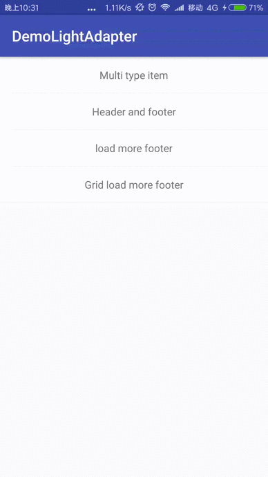
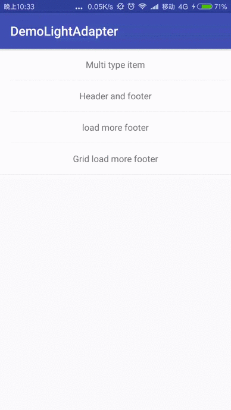
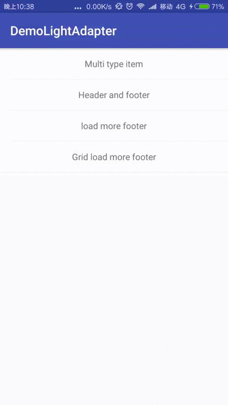

# LightAdapter
一个为`RecyclerView`打造的轻量级，可配置化，无侵入性，快速的Adapter。( Inspired by - [drakeet/MultiType](https://github.com/drakeet/MultiType) )

[](LICENSE)

## 截图








我们使用`RecyclerView`的Adapter无非就几个目的：

1. 基本使用
1. 显示多种类视图
1. 添加header和footer
1. 滑到底部自动加载更多（加载失败，重新加载等多种状态）

至于下拉刷新，Google已经提供了`SwipeRefreshLayout`，它已经非常好用，无需重复造轮子，而其他的功能LightAdapter均已实现。注意,滑到底部自动加载更多
其实不属于LightAdapter的功能，而是LightAdapter的一个扩展footer，你完全可以不用或者实现自己的footer，而对LightAdapter没有任何影响。下面说一下LightAdapter的核心：

LightAdapter的核心其实是多类型视图，是看了[drakeet/MultiType](https://github.com/drakeet/MultiType)的开源库受到启发并进行了改进（没用采用全局静态注册，注册时添加泛型约束，减少出错）。

先说滑到底部自动加载更多原理：

`RecyclerView`的Adapter的原理大家都知道：当某一个Item显示在屏幕中时，会调用Adapter的`onBindViewHolder`方法来让你绑定数据，但我们可以不用来绑定数据，列表中的最后一个Item出现时，
在这个Item会调用`onBindViewHolder`方法，所以如果增加一个回调，那这个Item不就是一个可以加载更多的Item了吗？原理就是这么简单。

所以header和footer其实只是一个和你的普通数据类型不一样的Item罢了，可以加载更多的Footer也不例外，而LightAdapter的工作只是管理这些多类型Item，并不关心具体的逻辑。所以，当你不使用
`LoadMoreFooter`时，LightAdapter便退化成普通的Adapter，而且性能没有任何损失。（ 性能测试可以参考：[drakeet/MultiType](https://github.com/drakeet/MultiType) ）

# 使用(详细的使用看Demo，基本包含所有使用场景,[Demo下载体验](apk/app.apk))
## 1. 依赖
Gradle:
```
compile 'com.lufficc:lightAdapter:0.0.1'
```
Maven
``` xml
<dependency>
  <groupId>com.lufficc</groupId>
  <artifactId>lightAdapter</artifactId>
  <version>0.0.1</version>
  <type>pom</type>
</dependency>
```
lvy
``` xml
<dependency org='com.lufficc' name='lightAdapter' rev='0.0.1'>
  <artifact name='$AID' ext='pom'></artifact>
</dependency>
```

## 2.注册Model
``` java
adapter.register(YourModel.class, new YourModelViewProvider());
adapter.register(YourHeaderModel.class, new YourHeaderModelViewProvider());
adapter.register(YourFooterModel.class, new YourFooterModelViewProvider());
```
其中第一个参数为你的Model（或者叫做Entity），没有任何限制，只要是Object的子类就行（笑）。
第二个参数为你需要继承`ViewHolderProvider`来返回ViewHolder和完成数据绑定。

你可以随时动态的注册你的Model,或者取消注册`adapter.unRegister(Class model)`。注册完毕之后，大功告成，只管添加你的数据，不用调用`notifyItem**`之类的方法，LightAdapter会根据你的操作自动调用最合适的。
## 3. 填充数据
``` java
    public void setData(Collection<?> initData);

    public void addData(Collection<?> newData);


    public void addHeader(Object header);

    public void addHeader(int position, Object header);


    public void addData(Object newData);

    public void addData(int position, Object newData);

    public void addFooter(Object footer);

    public void addFooter(int position, Object footer);

    public void removeHeader(int position);

    public void removeData(int position);

    public void removeFooter(int position);

    public void removeHeader(Object header);

    public void removeData(Object removingData);

    public void removeFooter(Object footer);

    public void clearHeaders();

    public void clearData();

    public void clearFooters();
```
## 4. Listeners
``` java
adapter.setOnFooterClickListener(OnFooterClickListener onFooterClickListener);//为Footer添加点击事件

adapter.setOnHeaderClickListener(OnHeaderClickListener onHeaderClickListener);//为Header添加点击事件

adapter.setOnDataClickListener(OnDataClickListener onDataClickListener);//为内容添加点击事件
```
## 5. LoadMoreFooter
如果你要使用加载更多功能，只需要注册就行：
``` java
adapter.register(LoadMoreFooterModel.class, new LoadMoreFooterViewHolderProvider());

LoadMoreFooterModel loadMoreFooterModel = new LoadMoreFooterModel();

adapter.addFooter(loadMoreFooterModel);
```
然后：

``` java
loadMoreFooterModel.noMoreData();//没有更多数据的时候调用
loadMoreFooterModel.errorOccur(); //出错的时候调用
loadMoreFooterModel.canLoadMore(); //有更多数据（一般为刷新的时候）的时候调用
```
自定义配置：
``` java
//自定义小图标
loadMoreFooterModel.setErrorIcon(int DrawableRes);
loadMoreFooterModel.setNoMoreIcon(int DrawableRes);
// 自定义显示信息
loadMoreFooterModel.setErrorMsg(String errorMsg);
loadMoreFooterModel.setNoMoreMsg(String errorMsg);
```
添加自定义事件：
``` java
// 添加加载更多的回调，加载数据
loadMoreFooterModel.setLoadMoreListener(LoadMoreListener listener)
// 添加footer的点击事件，比如恢复加载
loadMoreFooterModel.setOnFooterClickListener(OnFooterClickListener onFooterClickListener)
```
## 详细的使用看Demo，基本包含所有使用场景

License
-------

    Copyright 2016 lufficc.

    Licensed under the Apache License, Version 2.0 (the "License");
    you may not use this file except in compliance with the License.
    You may obtain a copy of the License at

       http://www.apache.org/licenses/LICENSE-2.0

    Unless required by applicable law or agreed to in writing, software
    distributed under the License is distributed on an "AS IS" BASIS,
    WITHOUT WARRANTIES OR CONDITIONS OF ANY KIND, either express or implied.
    See the License for the specific language governing permissions and
    limitations under the License.